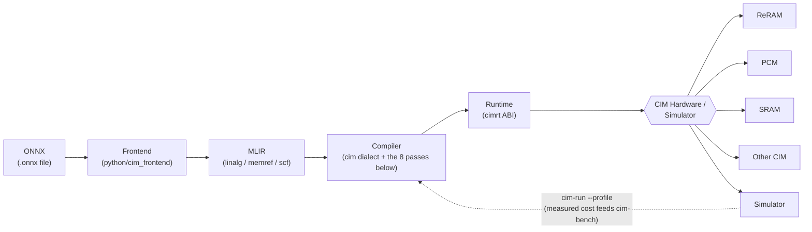

# cim-mlir

**An open compiler and runtime for compute-in-memory (CIM) and processing-in-memory
(PIM) hardware.**

The goal: take a normal quantized neural network — an ONNX file — and run it on CIM
hardware, without hand-writing assembly or using a vendor's closed compiler.

| Part | What it is |
|---|---|
| **Compiler** | An MLIR dialect (`cim`) plus eight lowering passes. The hardware is described by a YAML target file, never hardcoded. |
| **Runtime** (`cimrt`) | A small C API that runs the compiled artifact on a simulator or real hardware. |
| **Benchmarks** (`cim-bench`) | Workloads and a cost model, so "is CIM better here?" becomes a measurable question. |

It is a *backend*, not a general ML compiler — it sits below IREE/TVM/XLA. The first
working targets are digital and near-memory, because that is what ships today.

**Read [`docs/abstraction.md`](docs/abstraction.md) first** — it is the hardware model
everything else follows from. [`docs/website/index.html`](docs/website/index.html) is the
same material as one browsable page.

## Quickstart

The core needs no LLVM or MLIR, so the benchmark runs straight away:

```sh
cmake -S . -B build -G Ninja -DCIM_ENABLE_MLIR=OFF -DCMAKE_BUILD_TYPE=Release
cmake --build build
ctest --test-dir build --output-on-failure
./build/bin/cim-bench run --target erbium-8t --out results.json
```

For the compiler itself you need MLIR 18. This project does not build LLVM; on
Debian/Ubuntu the distro packages are enough:

```sh
sudo apt-get install llvm-18-dev libmlir-18-dev mlir-18-tools
pip install lit

cmake -S . -B build -G Ninja \
  -DMLIR_DIR=/usr/lib/llvm-18/lib/cmake/mlir \
  -DLLVM_DIR=/usr/lib/llvm-18/lib/cmake/llvm \
  -DLLVM_EXTERNAL_LIT="$(which lit)" \
  -DCMAKE_BUILD_TYPE=Release
cmake --build build
cmake --build build --target check-cim-opt
```

Compile and run a real `.onnx` file through the whole thing:

```sh
pip install -r test/python/requirements-onnx.txt
PYTHONPATH=python python3 -m cim_frontend model.onnx --input activations.npy \
  | ./build/bin/cim-opt - --cim-detect \
      --cim-partition=target-yaml=targets/erbium-8t.yaml \
      --cim-placement=target-yaml=targets/erbium-8t.yaml \
  | ./build/bin/cim-run --target-yaml=targets/erbium-8t.yaml --profile -
```

See [`python/README.md`](python/README.md) for what the ONNX front end accepts.

## The pipeline



Only the **Simulator** backend is real today — every test and benchmark in this repo
runs against it. **ReRAM/PCM/SRAM/"Other CIM"** are not separate implementations; they
are points on the target-YAML axes described in
[`docs/abstraction.md`](docs/abstraction.md), reachable with no dialect or compiler
change, not chips this project currently runs on. See that document for the full model.

| # | Pass | What it does |
|---|---|---|
| 1 | `cim-detect` | Finds INT8 matmuls with a constant weight operand |
| 2 | `cim-partition` | Splits the weight into tile-sized blocks; emits `cim.program`/`cim.mvm`, partial-sum reduction, and explicit memory-space transfers |
| 3 | `cim-placement` | Decides which weights live in which tile, and when. **The pass this project exists for.** |
| 4 | `cim-schedule` | Inserts `cim.barrier` conservatively; keeps source order |
| 5 | `cim-insert-transfers` | Inserts `cim.copy` when an activation is not already in near memory |
| 6 | `cim-legalize-precision` | Inserts `cim.requantize` after every terminal accumulator |
| 7 | `cim-lower-to-target` | Rewrites `cim` ops into `cimrt` C ABI calls, so the module can become a real binary |
| 8 | `cim-cost-report` | Walks the final IR and emits the cost JSON |

All eight are implemented and compose end to end on one module
(`test/Transforms/cim-pipeline-full.mlir`). Remaining scope limits are *refused with a
diagnostic*, never silently mislowered — a module that compiles and computes the wrong
function is worse than one that does not compile. See
[`docs/roadmap.md`](docs/roadmap.md).

## The result that matters

`cim-placement` uses a Belady (furthest-in-future) schedule, which a runtime cache can
never implement — but a compiler can, because the model graph is static.

`cim.program` ops emitted on `erbium-8t` (8 tiles, 1000 inferences), lower is better:

| Workload | Belady | LRU | FIFO |
|---|---|---|---|
| `mm-fit` | **8** | 8 | 8 |
| `mm-spill-2x` | **8538** | 16000 | 16000 |
| `mlp-3layer` | **4370** | 12000 | 12000 |

`mm-fit` programs its tiles once and then never again, across all 1000 inferences. Under
spill pressure, compile-time knowledge cuts weight programming by 47–64% against LRU.

The compiler's own output on real IR reproduces `mm-fit` exactly and comes within 5.5% of
the simulator's optimum on `mm-spill-2x` — that gap is measured and reported, not
estimated. See [`bench/workloads/README.md`](bench/workloads/README.md).

## Verification

A compiler that emits plausible IR is worth nothing; the question is whether the numbers
are right. Six suites answer different parts of that, and CI runs all of them.

| Suite | What only it would catch |
|---|---|
| `ctest` — `cim-unit-tests` | Placement, cost model, target reader, `cimrt` error paths. Includes a property test against exhaustive search over ~4700 instances. |
| `ctest` — `cim-mlir-tests` | Runs the real passes, then *executes* the result and compares against a C++ reference. Matching shapes is not matching arithmetic. |
| `check-cim-opt` (lit/FileCheck) | Dialect round-trips, verifier rejections, pass output structure, refusals. |
| `pytest test/python` | Differentials against other people's oracles: PyYAML, numpy, and ONNX's own reference implementation. |
| ASan, UBSan, valgrind | Memory and UB bugs that give correct answers today. |
| gcovr, clang-tidy, cppcheck | Untested branches and defects nobody wrote a test for. |

```sh
ctest --test-dir build --output-on-failure
cmake --build build --target check-cim-opt
pytest test/python

cmake -S . -B build-asan -G Ninja -DCIM_SANITIZER=address,undefined \
  -DCIM_ENABLE_WERROR=ON -DCMAKE_BUILD_TYPE=RelWithDebInfo
```

Optionally, `-DCIM_ENABLE_REAL_TARGET_E2E=ON` builds pairs of *real linked binaries* per
feature — one computing the right answer, one deliberately wrong — and `ctest -R
real-target` requires the first to exit 0 and the second to genuinely crash.

Coverage is gated at 85% line / 78% branch over `lib/Placement`, `lib/Target`,
`lib/Interpreter` and `runtime/src` (currently 90.3% / 83.3%).

## Repository layout

The project splits in two: a core with no LLVM/MLIR dependency, and the MLIR layer on top.
The interesting algorithm lives in the core, which is why it is testable without a
toolchain build.

```
include/cim/Placement/   placement engine + cost model API   (core, no MLIR)
include/cim/Target/      target description schema           (core, no MLIR)
include/cim/Dialect/     ODS (TableGen) dialect definitions  (MLIR)
include/cim/Transforms/  ODS pass declarations               (MLIR)
lib/Placement/           Belady/LRU/FIFO placement, cost model, workloads
lib/Target/              target file reader
lib/Dialect/             dialect implementation
lib/Transforms/          the eight lowering passes
lib/Interpreter/         executes the emitted IR against cimrt
runtime/                 cimrt C API: functional simulator, hardware backends
tools/cim-bench/         benchmark harness   (core, no MLIR)
tools/cim-opt/           the MLIR opt driver
tools/cim-run/           runs a compiled module and prints its results
python/cim_frontend/     ONNX front end: .onnx -> pipeline MLIR (no MLIR dep)
test/                    unit, numerical, FileCheck, python, and real-binary suites
targets/                 hardware target description YAML files
docs/                    abstraction model, dialect reference, target format, roadmap
bench/                   benchmark workloads and plot scripts
```

## License

Apache-2.0 — see [`LICENSE`](LICENSE). Chosen over GPL so hardware vendors can adopt this
without a copyleft obstacle; that adoption is the point.
