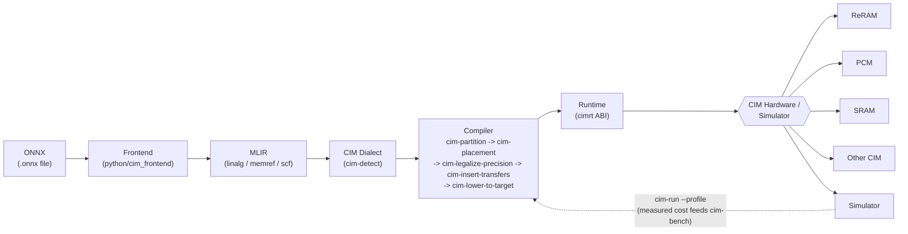

# The hardware abstraction model

This is the most valuable file in the repository. Everything else follows from it.

## Pipeline at a glance

The tile abstraction below (`!cim.tile`, one target YAML per chip) is what lets one
compiler and one dialect target every box in that bottom row without a
per-backend recompile — see "The unifying abstraction: the tile" below.

**What is actually wired up today**, so this diagram is not read as more finished than
it is: the **Simulator** backend (`runtime/src/simulator`) is real and is what every test
and benchmark in this repo runs against. The **Erbium-8T** hardware backend
(`runtime/src/erbium`) exists as a stub — every entry point currently returns
`CIMRT_ERR_NO_DEVICE` (see `docs/roadmap.md`'s M5). ReRAM/PCM/SRAM/"Other CIM" are not
separate backend implementations; they are points on the five axes of variation below,
each describable by a target YAML today with no dialect or compiler change required, the
central claim this document exists to make. Real ReRAM/PCM silicon becoming a working
`cimrt` backend is future work, tracked in `docs/roadmap.md`'s M5.

## The problem

CIM/PIM hardware exists and some of it ships. What does not exist is a way to run a normal
neural network on it without hand-written assembly or a vendor's closed, single-chip
compiler. Every vendor rebuilds this layer privately. Academic work (PrIM, SimplePIM,
DaPPA) solved it for exactly one chip. So CIM hardware has no software gravity — and
hardware without software gravity does not get adopted.

## Five axes of variation

Real hardware varies along five axes. A useful abstraction parameterizes all five and
assumes none.

| Axis | Range in real hardware | Why the compiler cares |
|---|---|---|
| **Compute locality** | In the bitcell array → at the sense amps → beside the bank → on the DIMM | Sets what one operation costs and what data must move |
| **Weight residency** | Persistent and weight-stationary → reloaded per layer | The dominant constraint. Reprogramming cost varies by ~1000× |
| **Persistence** | Volatile SRAM → non-volatile MRAM/RRAM/flash | Non-volatile weights survive power-off, enabling execution models a normal compiler has no equivalent for |
| **Precision** | Analog 3–8 effective bits → digital INT8/FP8/BF16 | Decides whether quantization passes are needed at all |
| **Control model** | Host-driven offload → autonomous in-memory cores | Decides whether the compiler emits a kernel or a whole program |

## The unifying abstraction: the tile

All CIM/PIM hardware is modeled as an array of **tiles**. A tile is:

> A fixed-capacity 2D compute-and-storage unit that can hold a weight sub-matrix and
> perform a matrix-vector multiply against it.

This is deliberately the lowest common denominator. A UPMEM DPU is a tile. A 256×256
digital SRAM macro is a tile. An analog crossbar is a tile. A near-memory RISC-V cluster
is a tile.

A tile carries `rows`/`cols`, its weight and activation dtypes, whether it is persistent,
and its programming and compute costs. See `!cim.tile` in
`include/cim/Dialect/CIMTypes.td` and the `tiles:` block in
[`target-format.md`](target-format.md).

## The asymmetry the compiler exists to exploit

On a GPU, loading weights and computing cost roughly the same. **On CIM hardware they
differ by orders of magnitude.** On non-volatile CIM the gap is extreme: writes are slow
and energy-hungry, but once written the weights sit there at zero standby leakage.

So the central optimization problem is not "schedule the math". It is:

> **Given N physical tiles and a model with M > N weight matrices, decide which weights
> live where and when, to minimize total reprogramming cost.**

No mainstream ML compiler solves this, because no mainstream hardware has this cost
structure. **This is the thesis of the project**, and `cim-placement`
(`lib/Transforms/CIMPlacement.cpp`) is the pass that implements it.

Because the model graph is static, the whole use sequence is known at compile time — so
Belady's optimal replacement policy, which a runtime cache can never implement, is
available here.

### How far it currently reaches

- **Within a block.** Two matmuls sharing a weight emit two `cim.program` ops instead of
  four. Under spill, Belady still beats LRU.
- **Across loop iterations.** A `cim.program` is hoisted out of an `scf.for` when its tile
  is written by nothing else in one iteration and the trip count is a compile-time
  constant proven positive. This reproduces the headline claim on real IR: a model that
  fits reprograms *once*, however many inferences run.
- **Under spill**, it emits `tiles-1` weights pinned plus `blocks-(tiles-1)` reprogrammed
  per iteration — the proven optimum for any *single loop body*. An unrestricted solve
  beats that only by varying its per-iteration program count, which a fixed loop body
  cannot express. On the standard spill shape the gap is 5.5%, and the compiler computes
  and reports both numbers rather than leaving it as a caveat.

## Reaching this model from a real file

`python/cim_frontend` reads a real `.onnx` file and emits this same MLIR, and its results
are checked against ONNX's own reference implementation rather than against this
project's idea of what a model means. Anything it does not recognize is refused, not
silently dropped — a module that compiles and computes a different function than the
model is worse than one that does not compile.

## Memory spaces

Three address spaces, modeled as memory-space attributes on `memref`
(`#cim.space<host|near|insitu>`):

- `host` — normal host DRAM
- `near` — memory local to the compute unit (DPU scratchpad, tile buffer)
- `insitu` — the weight array itself, where compute happens

Transfers between spaces are explicit `cim.copy` ops. Nothing is implicit. That single
decision is what makes cost modeling honest: every byte that moves is visible in the IR,
so every byte that moves is accounted for.

## Not modeled in v0.1

Training, floating point, attention/softmax, multi-chip execution, dynamic shapes, analog
noise, and autotuning. Analog CIM is modeled as a target *class* but the first working
targets are digital. Cycle-accurate timing is deliberately out of scope in favor of an
analytical cost model; if real timing is later needed, integrate Ramulator2 rather than
rebuilding a simulator.
